# Forgotten Places

## Fase 2 — useContext / useRef / Tema Visual

En esta fase continué haciendo cambios en **Forgotten Places Centro América**, que es un journal personal de viajes enfocado en lugares olvidados.

Para esta fase conecté el frontend con las dos formas de almacenamiento disponibles: LocalStorage y la API que hice en la Fase 1. También coloqué tema claro y oscuro con usos de useRef, atajos de teclado, categorías personalizadas y también realicé cambios y mejoras para continuar con la aparencia de una revista journal. 

[Video FASE 2 PREVIEW](https://canva.link/xzjkmlyqk824mm1)

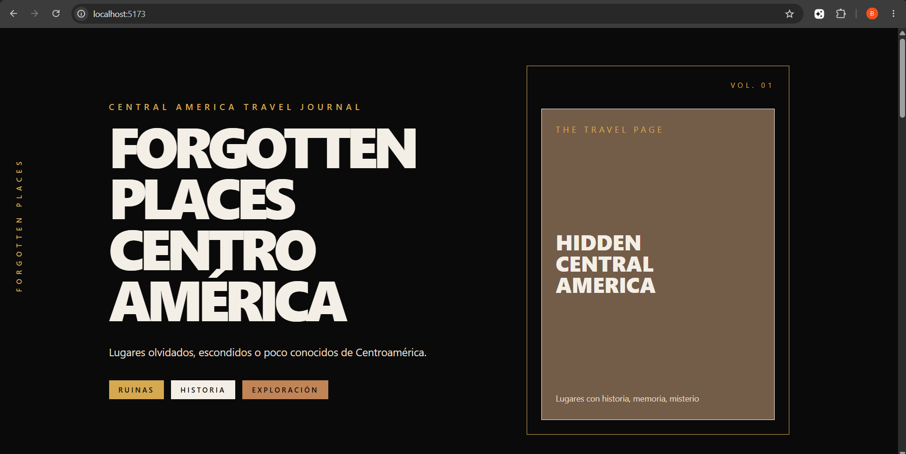

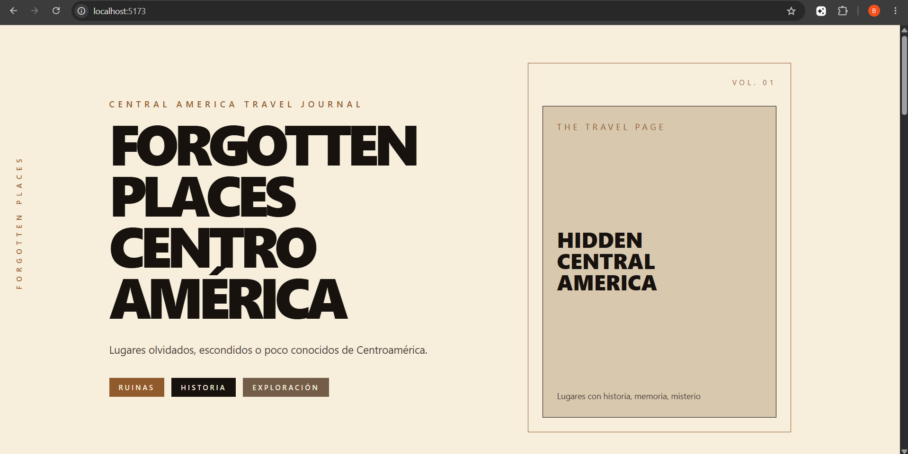

---

## 1. ¿Qué entregué en la Fase 2?

En esta fase hice lo necesario para incluir el StorageContext que hace que funcione en dos modos distintos:

1. **Modo LocalStorage:** los lugares se guardan localmente en el navegador y cambia según quién lo acceda.
2. **Modo API:** los lugares se envían al backend con Express y se guarda la info en SQLite.


Incluye: 
- Usé el ThemeContext para manejar el tema. 
- Hay persistencia del tema seleccionado en LocalStorage
- Dos usos de useRef
- Atajos de teclado
- Cinco categorías personalizadas con su emoji y  su color
- Los lugares guardados tipo revista.
- Edición completa de entradas.
- Puntuación personal mediante estrellas.
- Interacción con animaciones

---

## 2. StorageContext

### 2.1 Qué hice

Utilicé el StorageContext para el origen de los datos. Así los componentes visuales no tienen condiciones. 

| Propiedad / Función | Tipo | Descripción |
|---|---|---|
| `modo` | `'api'` o `'local'` | Indica el modo de almacenamiento de la data. |
| `setModo(modo)` | `function` | Cambia entre modo local y modo API, y guarda lo que el user escoge. |
| `obtenerItems()` | `async function` | Trae los lugares registrados según el modo. |
| `guardarItem(item)` | `async function` | Guarda una nueva entrada en LocalStorage/API. |
| `actualizarItem(id, itemUpdated)` | `async function` | Actualiza un lugar. |
| `eliminarItem(id)` | `async function` | Archiva un lugar. |

Agregué la función actualizarItem() porque mi journal permite editar completamente la información de un lugar que ya está. 


### 2.2 Implementación

En el modo local, las funciones trabajan con LocalStorage.
En el modo api, las funciones utilizan fetch para comunicarse con el backend y guardar los datos.
Los componentes de formulario lista e items no contienen condiciones.
La vista funciona igual sin importar el almacenamiento que se eliga.

### Evidencia de modo LocalStorage

En modo local puedo crear, ver, editar y archivar entradas. Los datos permanecen disponibles después de recargar la página.

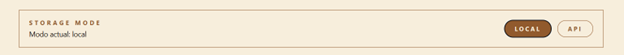

### Evidencia de modo API

En modo API puedo hacer lo mismo pero utilizando el backend.

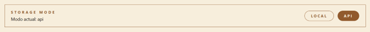

---

## 3. ThemeContext Tema Claro / Oscuro

Tengo el contexto de ThemeContext para controlar la apariencia del journal.

Los dos temas son:
- **Tema oscuro:** es como una revista editorial con fondos oscuros y detalles vibrantes
- **Tema claro:** es más como una página de papel con fondo claro.

Cuando seleccionas un tema este se guarda en el LocalStorage, entonces permanece  después de recargar la página. También coloqué un data-theme en el body para aplicar el tema.

### Tema oscuro


### Tema claro


---

## 4. useRef 

### 4.1 Focus automático en el input del nombre de un nuevo. 

Para el primer useRef, lo puse dentro del FormularioItem para el campo **Nombre del lugar**  para un nuevo lugar escondido. 

Decidí colocar este useRef porque esto mejora la experiencia cuando alguien la utiliza porque permite continuar agregando nuevos lugares escondidos.

esto se ve en la lína: nombreInputRef.current.focus() ;


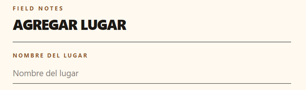

### 4.2 Referencia de setInterval en JournalTimer

Para la segunda referencia puse useRef dentro del componente para JournalTimer para poder almacenar el identificador de un setInterval.

El timer te muestra cuánto tiempo lleva activa la sesión del journal. Lo almacené con un useRef porque no necesita provocar un nuevo cada vez.

Para esto usé:

```js
intervaloRef.current = setInterval(() => { setSegundos( ( tiempoActual ) => tiempoActual + 1 ) ; } , 1000 ) ;
```

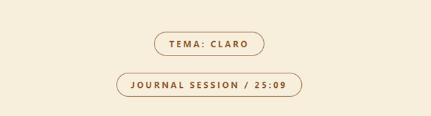

---

## 5. Categorías Personalizadas

Decidí poner las siguientes categorías y cada una tiene:
- `id`
- `nombre`
- `emoji`
- `color` 

| Categoría | Emoji | Uso dentro del journal | Color |
|---|---:|---|---|
| Ruinas | `🏛️` | lugares con estructuras antiguas o arquitectura. | `#D6A84F` |
| Histórico | `📜` | lugares relacionados con historia o patrimonio. | `#735D49` |
| Natural escondido | `🌿` | lugares naturales. | `#2F855A` |
| Pueblo olvidado | `🏘️` | comunidades o pueblos. | `#C08457` |
| Misterioso | `🕯️` | lugares con historias misteriosas. | `#6D4A8D` |

No me encantaba la idea de colocar emojis, pero como era parte de la rúbrica decidí que el emoji estuviera escondido con  una animación, así no arruinaba la estética. El círculo de color que muestro revela el emoji al hacer click. 

Al hacer clic sobre el círculo:

- se hace una animación
- aparece el emoji 
- al volver a hacer clic, regresa el círculo de color original

### Indicador de color

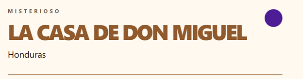

### Emoji revelado

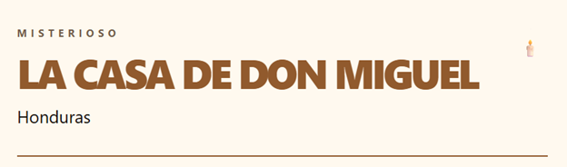

---

## 6. Atajos de Teclado

Puse los dos atajos de teclado.

| Atajo | Acción |
|---|---|
| `Alt + N` | pasa automáticamente al campo **Nombre del lugar** para comenzar una nueva entrada  |
| `T` | cambia entre el tema claro y oscuro cuando no estoy escribiendo dentro de un campo |

Inicialmente quería usar el `Ctrl + N`, como aparece en la guía. Pero esta combinación corresponde al atajo predeterminado del navegador para abrir una nueva ventana y estaba reservado. Por esta razón utilicé `Alt + N`, evitando interferir con el comportamiento normal del navegador. 

Ambos atajos los puse por medio de useEffect, agregando el evento keydown en el componente y se quitá por cleanup. 

---

## 7. Personalización

### Mi paleta de colores

Mi diseño está inspirado en una revista de viajes editorial. 

### Tema oscuro

| Uso visual | Valor hexadecimal | Justificación |
|---|---:|---|
| Fondo principal | `#0A0A0A` | Utilicé un fondo casi negro para representar una portada editorial elegante y darle protagonismo a las páginas internas del journal. También permite que los detalles dorados tengan mayor contraste. |
| Página interior | `#F7EEDC` | Elegí un beige claro para simular una hoja de revista. Esto ayuda a diferenciar las secciones. |
| Texto principal | `#F4EFE6` | Utilicé un tono claro cálido en lugar de blanco puro para facilitar la lectura sin romper el estilo. |
| Texto secundario | `#E9DDC8` | Lo puse en subtítulos y descripciones pata tener jerarquía . |
| Acento principal | `#D6A84F` | Elegí un dorado cálido para títulos importantes. |
| Acento secundario | `#C08457` | Es mi otro apoyo visual en subtítulos y cosas secundarias. |

### Tema claro

| Uso visual | Valor hexadecimal | Justificación |
|---|---:|---|
| Fondo principal | `#F7EEDC` | Elegí un fondo tipo papel para que el tema claro represente un papel. |
| Página interior | `#FFF9EF` | Es un tono más claro para separar las páginas. |
| Texto principal | `#17120E` | Sirve para tener buena legibilidad sobre lo claro sin usar negro puro. |
| Texto secundario | `#4A4037` | Lo puse en descripciones y contenido complementario. |
| Acento principal | `#915A2D` | Combina muy bien como acento principal y mantiene el estilo. |
| Acento secundario | `#735D49` | Es para títulos pequeños y subcategorías. |


---

## 8. Mejoras Adicionales Implementadas

Además de los requisitos obligatorios de la fase puse cambios adicionales para mejorar la experiencia y lo visual. Esto lo decidí hacer en esta etapa ya que no quería avanzar sin tener una base bien pulida. 

### 8.1 Buscador dentro del archivo

Puse un buscador dentro de la sección **Archivo de lugares**. El buscador filtra las entradas utilizando:

- nombre del lugar
- país
- categoría
- estado de exploración

Decidí agregar esto porque al agregar lugares registrados, pasar por todas las entradas era incómodo. 

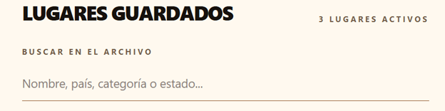

### 8.2 Navegación por páginas individuales

Primero se miraban todos los lugares juntos en una lista, entonces transformé el archivo en una navegación por páginas individuales. 
Esto lo decidí porque estaba más bonito y porque como tenía ya un diseño de revista quería que se viera tipo pasar página. 

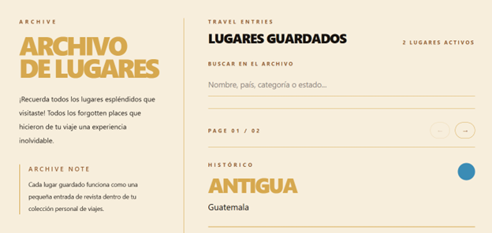

### 8.3 Indicador interactivo de categoría

La guía pedía el emoji y color para identificar las categorías. Pero como mo me gustaba cómo se miraba le puse una animación. 


### 8.4 Puntuación personal con estrellas

La que tenía al principio tenía la puntuación del 1-10. Decidí cambiarla por un sistema visual de 5 estrellas porque está más bonito. 

El valor sigue almacenándose dentro del campo puntuacion, pero la interfaz ahora permite calificar cada lugar de una forma más divertida.

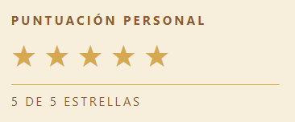

---

## 9. Uso de Inteligencia Artificial

Utilicé IAcomo apoyo puntual para implementar dos mejoras interactivas y visuales dentro del proyecto.

### 9.1 Animación del indicador de categoría

Consulta realizada:

> Hola chat, tengo una idea para utilizar animaciones en un proyecto de html y Javascript. Me pidieron como requisito poner un emoji, pero en realidad no me gusta cómo se ve el emoji siempre visible, pero debo ponerlo. ¿Cómo podría hacer que el círculo del color que sale según la categoría sea clickeable y que, al darle clic, aparezca el emoji? Esto quisiera hacerlo con Anime.js.

IA Utilizada: Chat GPT

Resultado aplicado:

Implementé un indicador interactivo en cada entrada del archivo. El elemento muestra inicialmente el color correspondiente a la categoría y, al hacer clic, revela el emoji mediante una animación. Al presionarlo nuevamente, vuelve a mostrarse el círculo de color.

La IA me guió en cómo utilizar anime.js para poder realizar esto. 

Este cambio permitió integrar el requisito de emoji y color manteniendo el estilo que quería.

### 9.2 Puntuación visual mediante estrellas

Consulta realizada:

> Hola, para un proyecto de html y JS quiero cambiar la puntuación personal del 1 al 10 y, en su lugar, colocar estrellas para calificar del 1 al 5. Necesito mantener el campo puntuacion que tengo establecido dentro del modelo de datos y que el cambio funcione al crear, mostrar y editar una entrada. Cuáles serían los cambios principales que tendría que realizar. 

IA Utilizada: Chat GPT

Resultado aplicado:

La IA me guió en los pasos que tendría que revisar. En realidad no era mucho y podía mantener mucho la estructura. Me ayudó en un ejemplo externo y con este ejemplo me logré guiar en cómo hacerlo. 

El valor continúa almacenándose numéricamente en el campo puntuacion, pero la interfaz representa la valoración de manera más visual e intuitiva. También cambié manualmente los valores anteriores para que sean concordantes. 


### 9.3 Paleta de colores alterna
Consulta realizada:

> Para un proyecto tengo los siguientes colores establecidos y tengo que hacer una versión en temática clara qué colores podría utilizar para realizar mi versión de tema claro? Toma en cuenta el contraste entre colores para fondo, texto y subtemas. 

IA Utilizada: Chat GPT

Resultado aplicado:

La IA me guió en los colores a utilizar para mi tema claro ya que no encontraba los colores que me gustaran y que funcionaran bien en temas de contraste. Utilicé los colores sugeridos por la IA para mi versión en tema claro. 


