# Forgotten Places

## Fase 3 — Reducer · Gráficas · Optimización

En esta fase continué con reemplazar el estado disperso por el  `useReducer`, agregar unas visualizaciones con Recharts y poder optimizar el rendimiento de la aplicación usando `useMemo`, `useCallback` y `React.memo`.

También mantuve la idea visual de revista digital, por esto lás gráficas están en un apartado nuevo de **Travel Insights**, como una nueva página 


[Video FASE 3 PREVIEW](https://canva.link/r10klhpd7kp0tea)

---

## 1. ¿Qué entregué en la Fase 3?

En esta fase implementé:

* Un reducer centralizado para manejar la lista de lugares, filtros, búsqueda y recomendaciones.
* Más de 7 acciones puras dentro de `itemsReducer.js`.
* Filtros combinados por categoría, estado y búsqueda.
* Botón para limpiar filtros.
* Tres gráficas con Recharts.
* Tooltip y leyenda en cada gráfica.
* Una gráfica original relacionada con la temática del proyecto.
* Optimización con `useMemo`, `useCallback` y `React.memo`.
* Evidencia antes y después usando React DevTools Profiler.
* Animación con Anime.js para representar visualmente las recomendaciones de viaje.

---

## 2. Implementación de useReducer

Reemplacé parte del estado disperso como lo pedía. 


Ahora tengo en un solo lugar la lista de lugares, los filtros activos y la búsqueda del archivo.

### Acciones implementadas

| Acción                | Función dentro del proyecto                                    |
| --------------------- | -------------------------------------------------------------- |
| `HIDRATAR`            | Carga los lugares obtenidos desde LocalStorage o desde la API. |
| `AGREGAR`             | Agrega un nuevo lugar a la colección.                          |
| `ELIMINAR`            | Archiva un lugar cambiando su estado activo a `false`.         |
| `CAMBIAR_ESTADO`      | Actualiza el estado de exploración de un lugar                 |
| `FILTRAR`             | Actualiza los filtros de categoría, estado o búsqueda.         |
| `LIMPIAR_FILTROS`     | Reinicia los filtros, quita los cambios de los filtros         |
| `REGISTRAR_ACTIVIDAD` | Registra una recomendación o corrección de recomendación.      |
| `EDITAR`              | Actualiza completamente los datos de una entrada existente.    |


---

## 3. Reducer puro


Para registrar una recomendación, la fecha se crea en App.jsx y el reducer solamente actualiza la lista con los datos que recibe.

---

## 4. Filtros combinados

Los filtros que ahora existen sirveb para buscar por:

* categoría
* estado de exploración
* nombre del lugar
* país

También agregué el botón de **Limpiar filtros**, que reinicia los filtros activos y regresa para mostrar todos. 

Las gráficas también reaccionan a estos filtros, por lo que si selecciono una categoría o escribo una búsqueda, las visualizaciones cambian según los lugares visibles en ese momento.


---


## 5. Registro de actividad adaptado a recomendaciones

La guía solicitaba implementar una acción llamada `REGISTRAR_ACTIVIDAD`.

Al principio probé manejarlo como una actividad documentada, pero sentí que no tenía tanto sentido con la temática de mi proyecto. Como Forgotten Places es un journal de lugares, decidí adaptar esa actividad a algo más natural para el contexto:

**recomendaciones de viaje**.

Ahora cada lugar puede registrar cuántas veces lo he recomendado. También agregué la opción de reducir el contador si me equivoco.

Internamente esto sigue usando la acción:

```js
REGISTRAR_ACTIVIDAD
```

pero visualmente se presenta como:

```txt
Recomendaciones de viaje
```

Cada recomendación guarda un registro con:

```js
valor: 1
```

y cada corrección guarda:

```js
valor: -1
```

Esto me permitió utilizar esos registros como base para las gráficas de la fase.


---


## 6. Animación de recomendaciones

Para reforzar la temática de viajes, agregué una animación con Anime.js.

Cuando se presiona el botón **+ Recomendar**, aparece un avión que recorre una ruta. Cuando se reduce la recomendación, el avión realiza el movimiento contrario.

Esta animación no cambia la lógica de los datos, solamente mejora la experiencia visual y conecta mejor la interacción con la idea de compartir o recomendar un destino.


---

## 7. Gráficas implementadas con Recharts

Agregué la sección separada llamada **Travel Insights**, donde se muestran las estadísticas del journal.

Esta sección funciona como una página especial dentro de la revista, separada del formulario y del archivo de lugares.

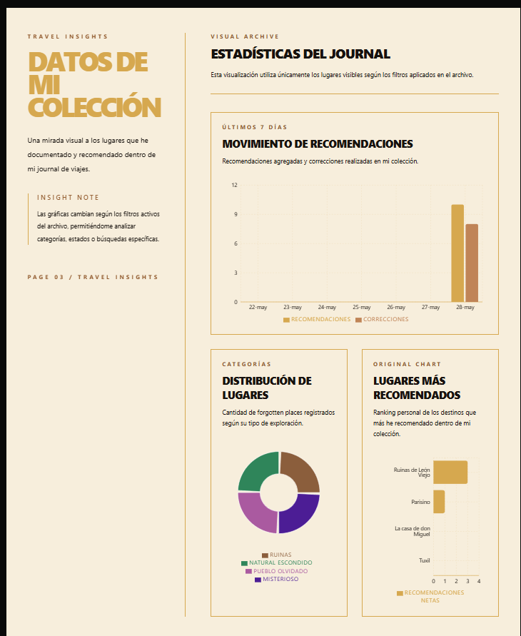
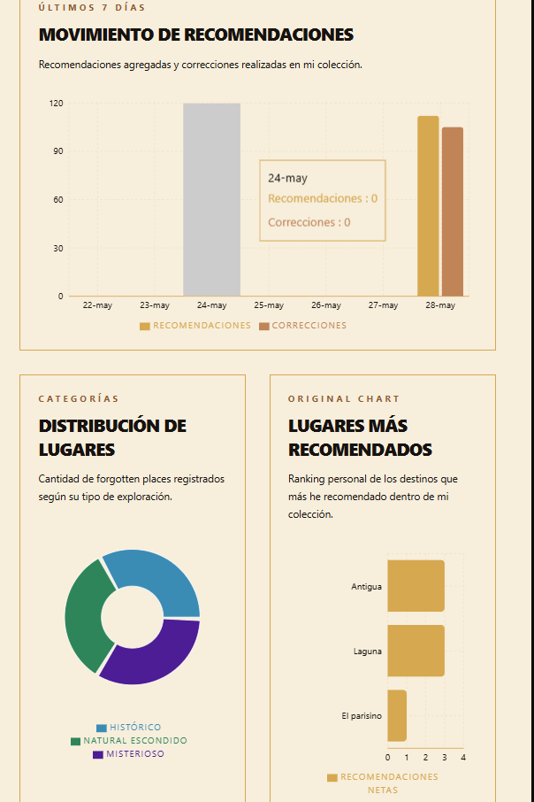

### Gráfica 1 — Movimiento de recomendaciones

La primera gráfica muestra las recomendaciones agregadas y correcciones realizadas en los últimos 7 días.

Utilicé una gráfica de barras porque permite comparar fácilmente la actividad diaria.

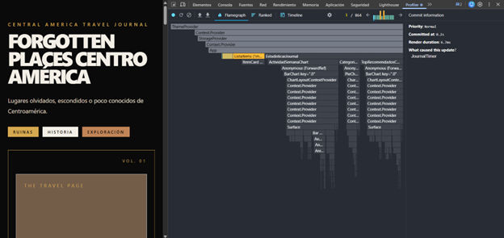

### Gráfica 2 — Distribución de lugares por categoría

La segunda gráfica muestra cómo se distribuyen los lugares guardados según su categoría.

Utilicé una gráfica circular porque permite ver de forma visual qué tipo de lugares predominan dentro de la colección.

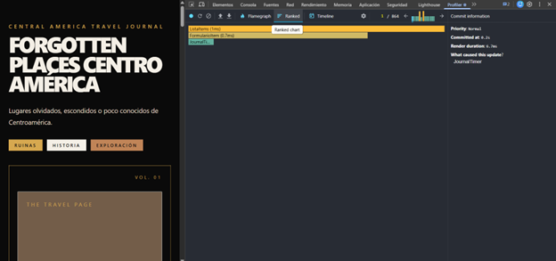

### Gráfica 3 — Lugares más recomendados

Esta fue mi gráfica original.

Muestra cuáles son los lugares más recomendados dentro de mi colección personal.

La elegí porque se relaciona directamente con la temática del proyecto. En lugar de usar una gráfica genérica, quise que esta visualización saliera de una interacción propia del journal. Así puedo identificar qué destinos considero más interesantes o valiosos para recomendar a otras personas.

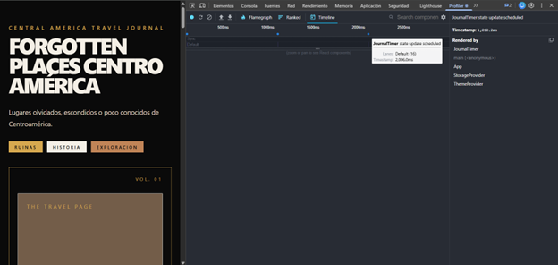

---

## 8. Mi gráfica original

Mi gráfica original se llama **Lugares más recomendados**.

Esta gráfica muestra un ranking de los lugares que más he recomendado dentro de mi colección.

Elegí esta gráfica porque conecta directamente con la idea de Forgotten Places. El proyecto no solo guarda lugares, sino que también permite identificar cuáles de esos destinos son más especiales o más compartibles desde mi perspectiva.

Me pareció una mejor opción que una gráfica genérica porque utiliza una interacción que yo misma agregué al proyecto: recomendar lugares.

---

## 9. Optimización con useMemo

Utilicé `useMemo` para evitar recalcular información cuando los datos no han cambiado.

Lo apliqué en:

* la lista filtrada de lugares activos
* el total de lugares activos
* los datos de la gráfica de los últimos 7 días
* los datos de distribución por categoría
* los datos de lugares más recomendados

Esto ayuda a que la aplicación no vuelva a calcular listas o datos de gráficas en renders donde no es necesario.

---

## 10. Optimización con useCallback

Utilicé `useCallback` en las funciones que se envían como props a componentes hijos.

Por ejemplo:

* agregar item
* archivar item
* editar item
* registrar recomendación
* cambiar filtro de categoría
* cambiar filtro de estado
* cambiar búsqueda
* limpiar filtros

Esto ayuda a que las funciones mantengan la misma referencia cuando sus dependencias no cambian, evitando renders innecesarios en componentes que reciben esas funciones.

---

## 11. React.memo

También utilicé `React.memo` en `ItemCard`.

Esto permite que la tarjeta del lugar no se vuelva a renderizar si sus props no cambiaron.

Además, también apliqué memoización en algunos componentes de gráficas, ya que contienen contenido más pesado por el uso de Recharts.

---

## 12. Evidencia con React DevTools Profiler

Utilicé React DevTools Profiler para comparar el comportamiento de la aplicación antes y después de la optimización.

### Antes de la optimización

Antes de aplicar `useMemo`, `useCallback` y `React.memo`, se observaba que al actualizarse la aplicación aparecían varios componentes grandes dentro del render.

Entre ellos se podían observar:

* `ListaItems`
* `FormularioItem`
* `JournalTimer`
* `EstadisticasJournal`
* gráficas de Recharts


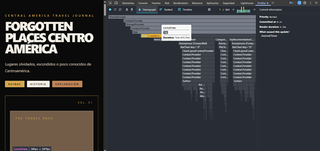

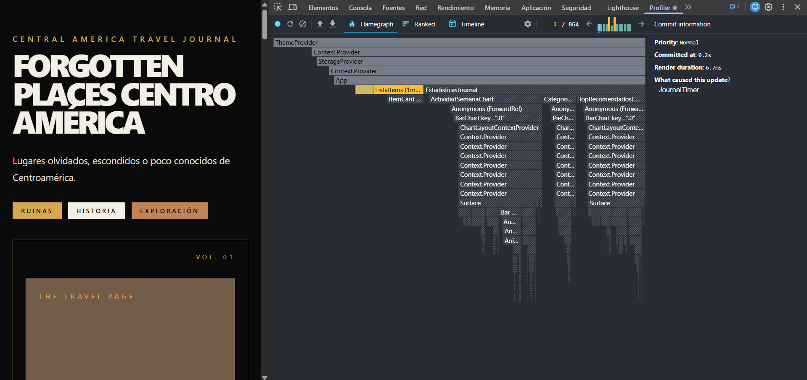

### Después de la optimización

Después de aplicar las optimizaciones, el render se redujo y se observó una actualización más enfocada.

En las capturas posteriores, los componentes principales que aparecen son:

* `FormularioItem`
* `ListaItems`
* `JournalTimer`

Además, se observa que la actualización fue causada principalmente por `JournalTimer`, sin arrastrar de la misma forma a las gráficas completas.


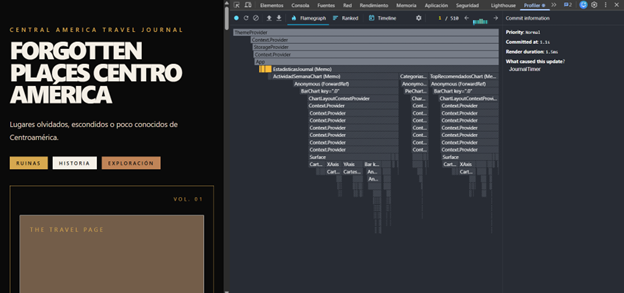

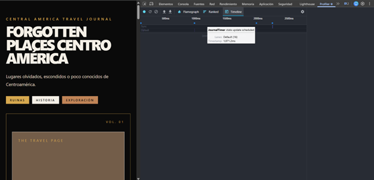

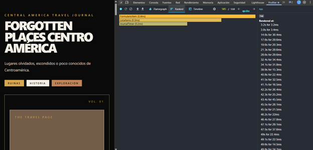

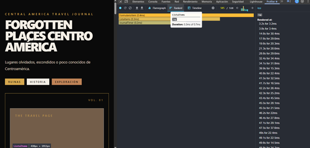


---

## 13. Mis 3 decisiones técnicas


### 13.1 Estructura del reducer


Con el reducer pude manejar desde un solo lugar:

* carga de datos
* creación de lugares
* edición
* archivo
* filtros
* búsqueda
* recomendaciones

Esto hizo que la lógica estuviera más ordenada y que las acciones fueran más fáciles de seguir.

### 13.2 Acción más difícil


La acción más difícil fue `REGISTRAR_ACTIVIDAD`

Al inicio no tenía claro qué significaría registrar actividad dentro de un journal de viajes. Pensé en usar una bitácora, pero sentí que se parecía demasiado a las notas personales que ya existían.

Por eso decidí convertir esa actividad en recomendaciones de viaje.

Esta decisión hizo que la acción tuviera más sentido dentro del proyecto y además me permitió usar esos datos para las gráficas.


### 13.3 Gráfica más compleja

La gráfica más compleja fue la de **Movimiento de recomendaciones**.

Esta gráfica no solo cuenta registros, sino que separa recomendaciones positivas y correcciones.

Para construirla tuve que revisar los registros de cada lugar, filtrar por fecha y luego clasificar los valores según fueran `1` o `-1`.

Fue más compleja que la de categorías porque no dependía únicamente de contar lugares, sino de procesar registros internos de cada item.

---

## 14. Uso de Inteligencia Artificial

Utilicé inteligencia artificial como apoyo puntual para implementar la animación del avión con Anime.js.

La lógica principal del proyecto, el diseño, el reducer, las gráficas y la integración final fueron revisadas y adaptadas dentro de mi código.

### 14.1 Animación del avión

Consulta realizada:

> Hola chat, quiero utilizar animate.js para incluir una animación de un avión cada vez que suba un contador y que regrese cuando baje. me podrías dar un ejemplo de uso para combinar con react y js, gracias

Resultado aplicado:

Implementé una animación en la sección de recomendaciones de cada lugar. Cuando el usuario aumenta el contador de recomendaciones, un avión recorre una ruta. Cuando reduce una recomendación, el avión realiza el movimiento contrario.

Esta animación fue utilizada para reforzar visualmente la idea de recomendar y compartir un destino dentro del journal de viajes.

