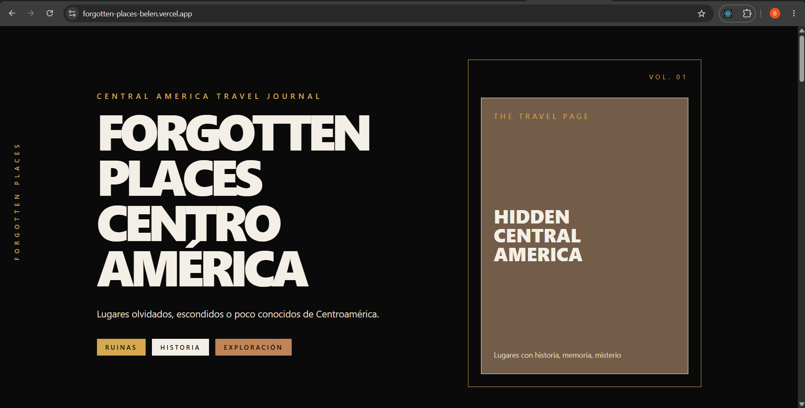
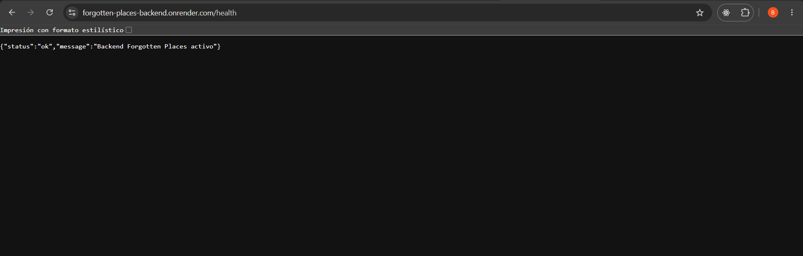
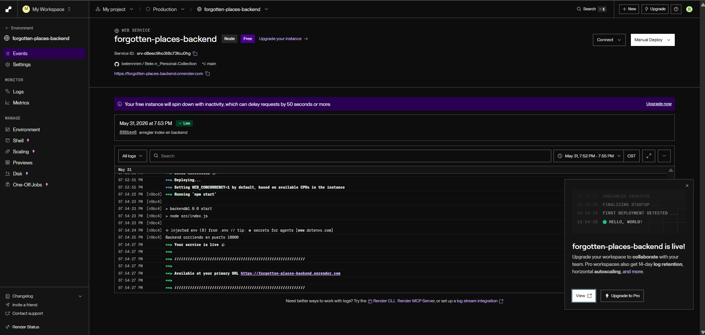
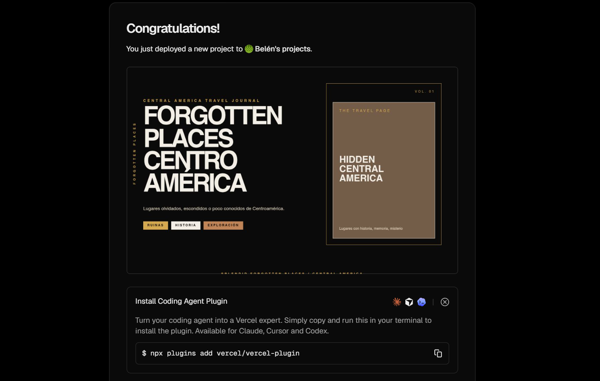

# Forgotten Places

## Fase 4

En esta fase cerré el proyecto Forgotten Places Centro América.

El objetivo principal fue extraer lógica reutilizable utilizando custom hooks, publicar la aplicación completa en producción y asegurar que el frontend y backend funcionaran correctamente fuera del entorno local.

[Video FASE 4 PREVIEW](https://canva.link/jjql0avo5sfmgwf)

---

## Custom Hooks implementados

Durante esta fase implementé cuatro custom hooks para separar lógica reutilizable de los componentes.

### useLocalStorage

Lo utilicé para almacenar información persistente dentro del navegador, especialmente la preferencia de tema claro y oscuro.

### useFetch

Lo utilicé para verificar el estado de conexión con la API.

Este hook incluye manejo de:

* data
* loading
* error
* AbortController

### useAtajoTeclado

Lo usé para implementar atajos de teclado dentro de la aplicación.

Actualmente permite cambiar entre tema claro y oscuro utilizando la tecla **T**.

### useRecomendacionesLugar

Este fue el hook de dominio propio.

Sirve para centralizar la lógica relacionada con las recomendaciones de lugares y evitar repetir código dentro de los componentes.

---

## Deploy del Backend

Para publicar el backend utilicé Render

El backend quedó disponible en:

https://forgotten-places-backend.onrender.com

Durante el proceso también configuré CORS para permitir solicitudes desde el frontend publicado.

### Backend publicado en Render

### Deploy exitoso del backend

---

## Deploy del Frontend

Para publicar el frontend utilicé Vercel

La aplicación quedó disponible en:

https://forgotten-places-belen.vercel.app

También configuré la variable de entorno `VITE_API_URL` para conectar correctamente con el backend desplegado en Render.

### Deploy exitoso del frontend

### Aplicación publicada

---
### Nota

la API puede reiniciarse ocasionalmente. Esto ocurre porque el backend está desplegado utilizando la versión gratuita de Render, por lo que algunos datos de prueba pueden perderse cuando el servicio se reinicia o se vuelve a desplegar.

---

## Uso de Inteligencia Artificial

Durante esta fase utilicé inteligencia artificial como apoyo para aprender a utilizar Vercel y Render, ya que nunca había trabajado con estas plataformas.

Prompt utilizado:

> Holaa, me podrías decircómo puedo iniciar con Vercel y Render para publicar mi frontend y backend si mi proyecto corre el front y el back por separado, nunca he utilizado estas apps y quiero saber cómo configurarlas bien. Para contexto estoy realizando una app publicada en GITHUB para una app de viajes. El objeto es hacer deploy del front y back para poder compartir una URL pública. 

La IA me ayudó a comprender el proceso de deploy, la configuración de variables de entorno y la conexión entre frontend y backend. Me apoyé en el ejemplo que me brindó y para saber lo que debería poner en pasos importantes del deploy. Para ser mi primera vez utilizando ambas apps, la IA me sirvió de gran apoyo. 

---

Esta fase me permitió completar mi app. Además de implementar custom hooks reutilizables, aprendí a desplegar mi app con Vercel y Render, resolver problemas de configuración, variables de entorno y CORS, y verificar que la aplicación funcionara correctamente fuera de mi entorno local.

